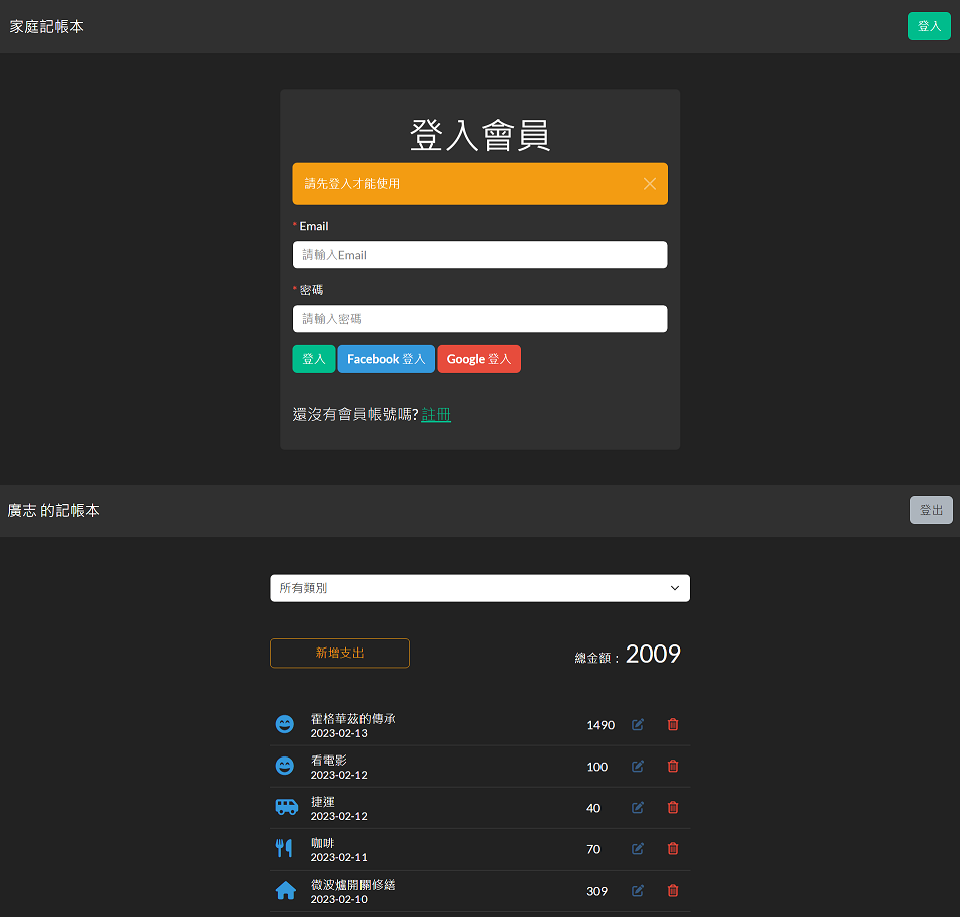

# Expense Tracker



## 雲端試用版

請進入[此網站](https://pure-retreat-90558.herokuapp.com/)並使用以下預設帳號及密碼登入使用：

|      Email       | Password |
| :--------------: | :------: |
| user@example.com |  123456  |

## 功能

- 使用者可以註冊會員並重新登入使用記帳功能
- 使用者可以使用 Facebook 或 google 帳號登入使用記帳功能
- 使用者可以登入會員使用記帳功能
- 使用者可以新增支出項目
- 使用者可以瀏覽支出項目及總金額
- 使用者可以修改支出項目內容
- 使用者可以刪除支出項目
- 使用者可以藉由輸入分類來瀏覽支出項目及總金額

## 開始使用

1. 請先確認已安裝 node.js 與 npm (版本請見下方開發工具)
2. 經由終端機 clone 或下載本專案至本地資料夾

```
https://github.com/Noelle-KH/expense-tracker.git
```

3. 於終端機進入存放本專案的資料夾

```
cd expense-tracker
```

4. 使用 npm 指令安裝套件

```
npm install
```

5. 新增`.env`檔案，並請根據`.env.example`檔案內資訊設置環境變數
6. 啟動專案前，請先建立種子資料，如在終端機中成功看到 done，即表示種子資料建立成功

```
npm run seed
```

7. 欲啟動專案，請繼續輸入

```
npm run dev
```

8. 若在終端機看到下方訊息代表順利運行，於瀏覽器中輸入該網址([http://localhost:3000](http://localhost:3000))即可開始使用本網站

```
Listening on http://localhost:3000
```

9. 如需暫停使用，請於終端機內按下 ctrl + c，即可結束

## 開發套件

- Node.js 14.16.0
- Express 4.18.2
- Express-handlebars 6.0.7
- Mongoose 6.9.1
- Passport 0.6.1
- Bootstrap 5.1.3
- Font Awesome 6.2.0
- 其他套件請見 package.json
